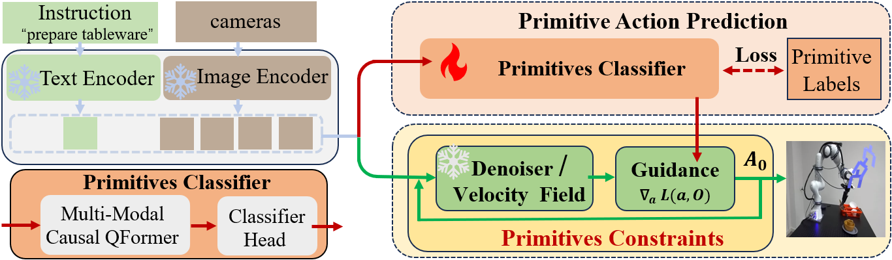

# PriGo

**Beyond Imitation: Test-Time Primitive Guidance to Diffusion and Flow Policies for Adaptive Robotic Manipulation**

## Introduction

Imitation learning in robotic manipulation often suffers from reproducing superficial patterns of demonstrations without capturing their underlying intent. Such rote learning is brittle, overly sensitive to contextual variations (e.g., lighting, colors, distractors), and fails to generalize across tasks and environments. To overcome these limitations, we propose PriGo, a primitive action guidance with test-time adaptation for robust robotic manipulation. Our approach introduces an automatic primitives extraction and learning module, which predicts primitive action categories from visual observations. This enables the automatic planning and composition of various primitives. We then propose a differentiable primitives guidance mechanism that constrains action generation to ensure the produced actions remain aligned with the intended primitives. This helps enhance both robustness and generalization during test-time execution. The proposed primitive guidance can be integrated into diffusion and flow policies without the need for retraining. Extensive experiments on the LIBERO, CALVIN, SIMPLER, and real-world robots show that PriGo-DP (PriGo + diffusion policy) and PriGo-FP (PriGo + flow policy) consistently outperform state-of-the-art methods in both manipulation performance and generalization ability. 

## 📑 Open-source Plan

- [x] Training and testing of PriGo
- [x] Checkpoints
- [ ] PriGo-DP on robotic manipulation tasks
- [ ] PriGo-FP on robotic manipulation tasks

## Get Started

#### Begin by cloning the repository:

```shell
git clone https://github.com/OTCVCG/PriGo.git
cd PriGo
```

#### Installation Guide for Linux

Run the following commands in the given order to install the dependency for **PriGo**.
```
conda create -n prigo python=3.10
conda activate prigo
conda env create -f environment.yml --force
```

#### Datasets
We use high-quality human teleoperation demonstrations for the four task suites from [**LIBERO**](https://github.com/Lifelong-Robot-Learning/LIBERO). To download the demonstration dataset, run:
```python
python libero_benchmark_scripts/download_libero_datasets.py
```
By default, the dataset will be stored under the ```LIBERO``` folder and all four datasets will be downloaded. To download a specific dataset, use
```python
python libero_benchmark_scripts/download_libero_datasets.py --datasets DATASET
```
where ```DATASET``` is chosen from `[libero_spatial, libero_object, libero_100, libero_goal`.

## Usage of PriGo
For training and testing with the [**pretrained models**](https://drive.google.com/file/d/1DC2-UoIUG0cdh0w5YM-Yn6BqA2W4NChM/view?usp=drive_link) of the primitive classifier, run:
```python
python main.py
```
